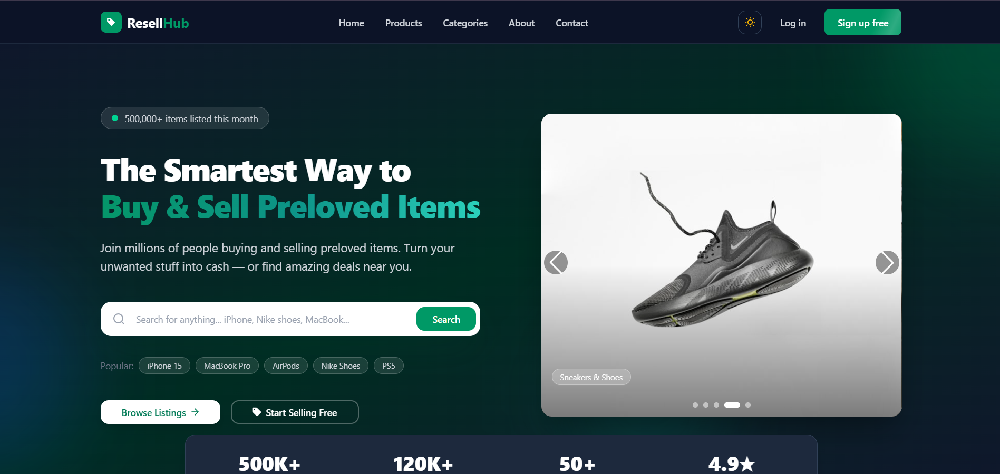
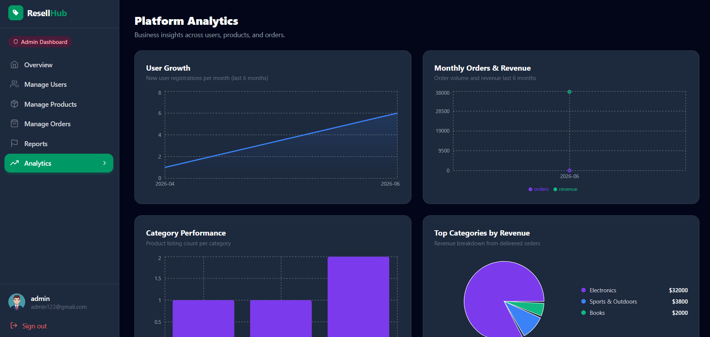

# ResellHub

🎉ResellHub is a full-stack second-hand marketplace platform that enables users 
to buy and sell pre-owned items seamlessly. Built with Next.js, Express.js, 
and MongoDB, it features secure authentication via Better Auth and Google OAuth, 
real-time payment processing with Stripe, image hosting through imgBB, 
and a modern responsive UI powered by Tailwind CSS and HeroUI.
---

## Live Demo

> https://resell-hub-tawny.vercel.app/

---

 Home                                 
 ------------------------------------ 
  

 Home                                 
 ------------------------------------ 
  


## Features

### Buyers

- Browse and search listings with filters (category, condition, sort)
- Paginated product grid and list view
- Product detail page with image carousel
- Add to cart and checkout with Stripe
- Wishlist / saved items
- Order tracking with status updates
- Cancel orders (Pending / Accepted / Processing only)
- Write reviews on purchased products
- Compare up to 3 products side by side (price, condition, category, stock)
- Report suspicious or misleading listings with reason selection
- View public seller profiles with listings, ratings, and reviews

### Sellers

- Dashboard overview with analytics charts
- Add, edit, and delete product listings (up to 4 images via imgBB)
- Manage incoming orders — Accept, Reject, update delivery status
- View buyer contact info (name, email, phone, address, location) per order
- Blocked accounts lose access to cart and add-product

### Admin

- User management — view, update status, delete
- Product management — approve, reject, flag reported listings
- Order management — view all orders with transaction IDs
- Reports panel — review, resolve, or dismiss reported listings
- Platform analytics — user growth, revenue, category performance

### General

- Email + password authentication via better-auth
- Google OAuth sign-in
- Dark / light mode toggle (persists in localStorage)
- Fully responsive — mobile, tablet, desktop
- Toaster notifications (react-hot-toast)

---

## Tech Stack

**Frontend**
- Next.js
- React
- Tailwind CSS
- HeroUI
- GSAP
- Swiper
- Recharts
- Stripe.js
- Better Auth
- React Icons
- Animate.css
- React Type Animation
- React Hot Toast

**Backend**
- Express.js
- MongoDB
- Stripe
- CORS

**External Services**
- MongoDB Atlas
- Cloudinary
- Stripe
- Google OAuth
## Project Structure

```
resell_hub/
├── src/
│   ├── app/
│   │   ├── (auth)/             # Login & signup pages
│   │   ├── dashboard/
│   │   │   ├── buyer/          # Orders, wishlist, payments, profile
│   │   │   ├── seller/         # Products, orders, analytics
│   │   │   └── admin/          # Users, products, orders, reports, analytics
│   │   ├── products/           # Product listing & detail pages
│   │   ├── sellers/[id]/       # Public seller profile (email-based routing)
│   │   ├── compare/            # Side-by-side product comparison
│   │   ├── cart/               # Shopping cart
│   │   └── checkout/           # Stripe checkout
│   ├── components/
│   │   ├── home/               # Hero, featured listings, testimonials, etc.
│   │   ├── dashboard/          # Sidebar shell, status badges
│   │   └── compare/            # Floating compare bar
│   ├── context/
│   │   ├── CartContext.jsx     # Cart state (localStorage per user)
│   │   └── CompareContext.jsx  # Compare list (max 3, localStorage)
│   └── lib/
│       ├── auth.js             # better-auth server config
│       ├── auth-client.js      # better-auth client hooks
│       └── api/                # Fetch helpers (products, orders, reviews, reports…)
└── public/
    └── screenshots/            # Add your screenshots here
```

---

## Getting Started

### Prerequisites

- Node.js 
- MongoDB Atlas account
- Stripe account
- Google OAuth credentials (optional)


### 1. Clone the repository

```bash
git clone https://github.com/tanvir-22/resell-hub.git
cd resell-hub
```

### 2. Install frontend dependencies

```bash
npm install
```

### 3. Configure environment variables

Create a `.env.local` file in the project root:

```env
# App
NEXT_PUBLIC_APP_URL=http://localhost:3000
NEXT_PUBLIC_SERVER_URL=http://localhost:5000

# MongoDB
MONGODB_URI=mongodb+srv://<user>:<password>@cluster.mongodb.net/resellhub

# better-auth
BETTER_AUTH_SECRET=your-secret-key

# Google OAuth (optional)
GOOGLE_CLIENT_ID=your-google-client-id
GOOGLE_CLIENT_SECRET=your-google-client-secret

# Stripe
NEXT_PUBLIC_STRIPE_PUBLISHABLE_KEY=pk_test_...
STRIPE_SECRET_KEY=sk_test_...

# Cloudinary
NEXT_PUBLIC_CLOUDINARY_CLOUD_NAME=your-cloud-name
NEXT_PUBLIC_CLOUDINARY_UPLOAD_PRESET=your-preset
```

### 4. Configure the Express backend

Create a `.env` in your backend folder:

```env
PORT=5000
MONGODB_URI=mongodb+srv://<user>:<password>@cluster.mongodb.net/resellhub
NEXT_URL=http://localhost:3000
```

### 5. Start development servers

**Frontend:**

```bash
npm run dev
```

**Backend** (in your backend folder):

```bash
node index.js
```

The app runs at `http://localhost:3000`.

---


